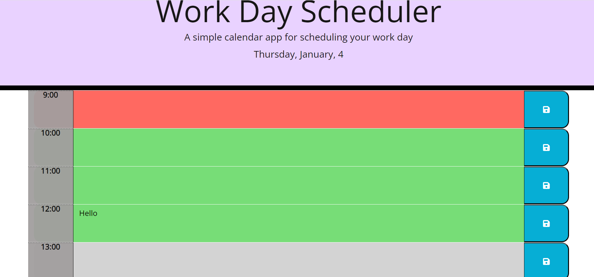

# My-Planner: week 7 challenge

## Description
This challenge illustrates the use of HTML, CSS and using JQuery to add to JavaScript to develop a Work-day planner application called 'My-Planner'. This allows you to add important events in your planner for your work day, dynamically update the present, past and future events using various color codes.

The codes were annotated carefully to allow anyone that accessed it to understand it easily and for continuity.

## Application
* [My-Planner Repository](http://github.com/clamadi/My-Planner)
* [My-Planner Application](http://github.com/clamadi/My-Planner)

## How to Use
To run this web page, right click on the index.html file and open on a browser of your choice.

Input any event on the time-slot input and clic on the save icon to save.

# Technologies
JavaScript, HTML, CSS.

# App Preview

### Resources

* [How to Build a Planner app](https://www.youtube.com/watch?app=desktop&v=YPU6gOctNvM)

#### Credit 
Credit youtube resource listed, the Xpert Learning Assistant and the class activities.

##### License
MIT License.

